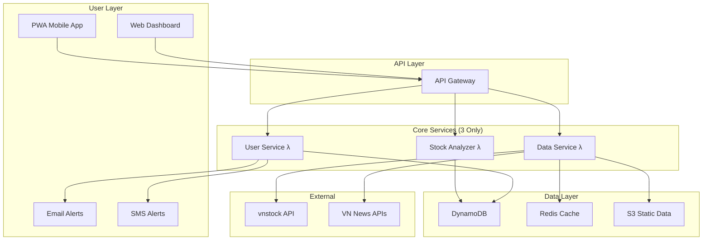
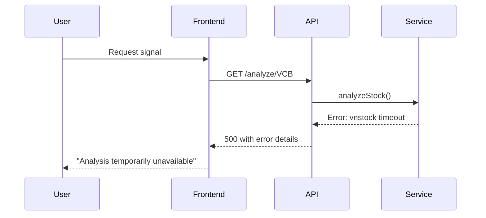

# Vietnam Stock Analysis System v2.0 Fullstack Architecture Document

**Document Version:** 2.0
**Date:** 2025-09-15
**Architect:** Winston
**System:** Vietnam Stock Analysis System with YAGNI Optimization

---

## Introduction

This document outlines the complete fullstack architecture for **Vietnam Stock Analysis System v2.0**, including backend systems, frontend implementation, and their integration. It serves as the single source of truth for AI-driven development, ensuring consistency across the entire technology stack.

This unified approach combines what would traditionally be separate backend and frontend architecture documents, streamlining the development process for your smart money detection system where Vietnamese market context, VSA/Wyckoff analysis, and real-time data processing are tightly integrated.

### Starter Template Analysis

**Decision**: Greenfield project with financial technology architecture patterns optimized for Vietnamese market specialization rather than standard web app starters.

**Change Log**

| Date | Version | Description | Author |
|------|---------|-------------|--------|
| 2025-09-15 | 1.0 | Initial architecture design with event-driven approach | Winston |
| 2025-09-15 | 2.0 | YAGNI optimization - simplified from 12 services to 3 core services | Winston |

---

## High Level Architecture

### Technical Summary

The Vietnam Stock Analysis System v2.0 employs a **simplified, cost-optimized architecture** focused on delivering core Vietnamese stock signal processing with VSA/Wyckoff analysis. The system uses **AWS serverless compute** with strategic simplification, **YAGNI principles** applied to reduce complexity from 12+ microservices to 3 core services, and **progressive enhancement** ensuring rapid MVP delivery. Core integration points include **vnstock API adapters** with simple retry logic, **Vietnamese context processing** for holiday/news integration, and **signal attribution tracking** for ROI measurement. The architecture prioritizes **rapid development** and **cost efficiency** ($50-200/month vs $2000+/month) while maintaining essential Vietnamese market specialization.

### Platform and Infrastructure Choice

**Platform:** AWS with Serverless Framework
**Key Services:** Lambda (3 functions), DynamoDB (2 tables), ElastiCache Redis (single node), S3, SES
**Deployment Host and Regions:** AWS ap-southeast-1 (Singapore) for low latency to Vietnamese markets

### Repository Structure

**Structure:** Monorepo with simplified service modules
**Monorepo Tool:** Nx (enterprise-grade, supports future expansion)
**Package Organization:** 3 core services, shared types, simplified infrastructure

```
vietnam-stock-system/
├── apps/
│   ├── web-app/              # React PWA
│   ├── stock-analyzer/       # Core analysis Lambda
│   ├── user-service/         # User management Lambda
│   └── data-service/         # Market data Lambda
├── libs/
│   ├── shared-types/         # TypeScript interfaces
│   ├── vietnamese-utils/     # Market-specific utilities
│   └── simple-config/        # Shared configuration
└── infrastructure/           # AWS CDK definitions
```

### High Level Architecture Diagram



### Architectural Patterns

- **YAGNI-Driven Simplification:** Reduce complexity from microservices to 3 core services - _Rationale:_ Deliver 80% value with 20% complexity
- **Serverless-First:** AWS Lambda for all compute with simple scaling - _Rationale:_ Cost optimization and reduced operational overhead
- **Progressive Enhancement:** Mobile-first PWA with email/SMS alerts (no WebSocket complexity) - _Rationale:_ Users check signals periodically, not continuously
- **Vietnamese Market Adapter:** Pluggable market-specific modules for future expansion - _Rationale:_ Enables future expansion while maintaining simplicity
- **Simple Caching Strategy:** Single Redis node with basic TTL - _Rationale:_ Premature optimization avoided, can scale later

---

## Tech Stack

### Technology Stack Table

| Category | Technology | Version | Purpose | Rationale |
|----------|------------|---------|---------|-----------|
| Frontend Language | TypeScript | 5.3+ | Type-safe frontend development | Critical for financial calculations and API contracts |
| Frontend Framework | React | 18.2+ | PWA with basic real-time capabilities | Mature ecosystem, excellent PWA support |
| UI Component Library | Ant Design | 5.12+ | Financial-focused component library | Pre-built charts, tables optimized for trading interfaces |
| State Management | Zustand + TanStack Query | 4.4+ / 5.8+ | Client state + server state management | Lightweight, good for periodic data updates |
| Backend Language | TypeScript | 5.3+ | Unified type system across stack | Shared types between frontend/backend, reduced errors |
| Backend Framework | Serverless Framework | 3.38+ | AWS Lambda orchestration | Optimal for cost efficiency and simple scaling |
| API Style | REST (no WebSocket) | HTTP/1.1 | Standard API with polling | Simpler than real-time, adequate for use case |
| Database | DynamoDB | Latest | Simple NoSQL storage | Auto-scaling, cost-effective for MVP |
| Cache | Redis (ElastiCache) | 7.0+ | Basic caching layer | Single node sufficient for MVP |
| File Storage | S3 | Latest | Static data storage | Cost-effective, simple integration |
| Authentication | AWS Cognito | Latest | User management + JWT tokens | Integrated with AWS ecosystem |
| Frontend Testing | Vitest + Testing Library | 1.0+ / 14.0+ | Fast unit + integration tests | Faster than Jest, excellent React component testing |
| Backend Testing | Jest | 29.7+ | Lambda function testing | Simple, proven approach |
| E2E Testing | Playwright | 1.40+ | Basic user flow testing | Essential for financial applications |
| Build Tool | Vite | 5.0+ | Fast development builds | Significantly faster than webpack |
| Bundler | esbuild (via Vite) | 0.19+ | Production bundling | Fastest bundler, TypeScript native support |
| IaC Tool | AWS CDK | 2.110+ | TypeScript infrastructure definition | Type-safe infrastructure, better than CloudFormation |
| CI/CD | GitHub Actions | Latest | Automated testing + deployment | Free for public repos, excellent AWS integration |
| Monitoring | CloudWatch | Latest | Basic system monitoring | Native AWS integration, sufficient for MVP |
| Logging | CloudWatch Logs + Winston | Latest / 3.11+ | Simple structured logging | Essential for debugging |
| CSS Framework | Tailwind CSS | 3.3+ | Utility-first responsive design | Rapid development, excellent mobile-first approach |

---

## Data Models

### Core Data Models (Simplified)

#### **User**
```typescript
interface User {
  id: string;
  email: string;
  subscription: 'free' | 'premium';
  preferences: SimplePreferences;
  createdAt: Date;
}

interface SimplePreferences {
  sectors: string[]; // ['Banking', 'RealEstate']
  alertMethods: ('email' | 'sms')[];
  riskLevel: 'conservative' | 'moderate' | 'aggressive';
  timeframe: 'daily' | 'weekly';
}
```

#### **MarketData**
```typescript
interface MarketData {
  symbol: string;
  timestamp: Date;
  timeframe: 'daily' | 'weekly';
  price: {
    open: number;
    high: number;
    low: number;
    close: number;
  };
  volume: number;
  indicators: {
    atr: number;
    relativeVolume: number;
    trend: 'up' | 'down' | 'sideways';
  };
}
```

#### **SimpleSignal**
```typescript
interface SimpleSignal {
  symbol: string;
  timestamp: Date;
  action: 'buy' | 'sell' | 'hold' | 'wait';
  confidence: number; // 1-10 scale
  reason: string; // Human readable explanation
  targetPrice?: number;
  stopLoss?: number;
  vietnameseNote?: string; // "Tet holiday - low liquidity expected"
  signalStrength: 'weak' | 'moderate' | 'strong';
}
```

#### **SimplePortfolio**
```typescript
interface SimplePortfolio {
  userId: string;
  positions: Array<{
    symbol: string;
    quantity: number;
    averageCost: number;
    currentValue: number;
    signalBased: boolean; // Did they follow our signal?
  }>;
  totalValue: number;
  totalReturn: number;
  signalWinRate: number; // Only metric that matters
  lastUpdated: Date;
}
```

#### **SimpleMarketContext**
```typescript
interface SimpleMarketContext {
  isHoliday: boolean;
  holidayType?: 'tet' | 'national' | 'bank';
  liquidityWarning: boolean;
  majorNews?: string; // One sentence summary
  volumeExpectation: 'low' | 'normal' | 'high';
}
```

---

## API Specification

### Simplified REST API

```yaml
openapi: 3.0.0
info:
  title: Vietnam Stock Analysis System API (Simplified)
  version: 2.0.0
  description: YAGNI-optimized API for Vietnamese stock signals

paths:
  /analyze/{symbol}:
    get:
      summary: Analyze stock and generate signal
      parameters:
        - name: symbol
          in: path
          required: true
          schema:
            type: string
            example: "VCB"
      responses:
        '200':
          description: Stock analysis signal
          content:
            application/json:
              schema:
                $ref: '#/components/schemas/SimpleSignal'

  /portfolio:
    get:
      summary: Get user portfolio
      responses:
        '200':
          description: User portfolio with performance
          content:
            application/json:
              schema:
                $ref: '#/components/schemas/SimplePortfolio'

  /portfolio/trade:
    post:
      summary: Record trade action
      requestBody:
        required: true
        content:
          application/json:
            schema:
              type: object
              properties:
                symbol:
                  type: string
                action:
                  type: string
                  enum: [buy, sell]
                quantity:
                  type: number
                price:
                  type: number
      responses:
        '200':
          description: Trade recorded

  /performance:
    get:
      summary: Get performance metrics
      responses:
        '200':
          description: Simple performance metrics
          content:
            application/json:
              schema:
                type: object
                properties:
                  totalReturn:
                    type: number
                  signalWinRate:
                    type: number
                  followedSignals:
                    type: number

  /preferences:
    post:
      summary: Update user preferences
      requestBody:
        required: true
        content:
          application/json:
            schema:
              $ref: '#/components/schemas/SimplePreferences'
      responses:
        '200':
          description: Preferences updated
```

---

## Components

### Core Services (3 Only - YAGNI Optimized)

#### **Vietnam Stock Analyzer Service**
**Responsibility:** Single service handling all signal processing with Vietnamese market context

**Key Interfaces:**
- Unified stock analysis with VSA + Wyckoff + Vietnamese context
- Simple signal generation (buy/sell/hold with confidence)
- Portfolio position tracking
- Basic performance attribution

**Dependencies:** vnstock API, simple Vietnamese context data

**Technology Stack:** Single AWS Lambda function, DynamoDB table, basic caching

```typescript
interface VietnamStockAnalyzer {
  // ONE METHOD TO RULE THEM ALL
  analyzeStock(symbol: string, userId?: string): Promise<SimpleSignal>;

  // SIMPLIFIED PORTFOLIO
  getPortfolio(userId: string): Promise<SimplePortfolio>;
  updatePosition(userId: string, trade: TradeUpdate): Promise<void>;

  // BASIC PERFORMANCE
  getPerformance(userId: string): Promise<SimplePerformance>;
}
```

#### **User Management Service**
**Responsibility:** Authentication, preferences, and alert delivery (email/SMS only)

**Key Interfaces:**
- AWS Cognito authentication wrapper
- User preferences management
- Simple alert delivery (no WebSocket complexity)
- Subscription management

**Dependencies:** AWS Cognito, AWS SES, AWS SNS

**Technology Stack:** AWS Lambda functions, DynamoDB for user data

```typescript
interface UserManagementService {
  // AUTHENTICATION
  authenticateUser(token: string): Promise<User>;

  // PREFERENCES (SIMPLE)
  updatePreferences(userId: string, prefs: SimplePreferences): Promise<void>;

  // ALERTS (EMAIL/SMS ONLY)
  sendSignalAlert(userId: string, signal: SimpleSignal): Promise<void>;
  sendPerformanceUpdate(userId: string, performance: SimplePerformance): Promise<void>;
}
```

#### **Vietnamese Market Data Service**
**Responsibility:** Data ingestion, basic Vietnamese context, and caching

**Key Interfaces:**
- vnstock API integration with simple retry logic
- Vietnamese holiday calendar
- Basic news impact scoring
- Market data caching (simple Redis)

**Dependencies:** vnstock API, basic news sources

**Technology Stack:** AWS Lambda for data processing, ElastiCache Redis (single node), S3 for static data

```typescript
interface VietnameseMarketDataService {
  // DATA INGESTION
  getMarketData(symbol: string, timeframe: 'daily' | 'weekly'): Promise<MarketData>;

  // VIETNAMESE CONTEXT (SIMPLIFIED)
  getMarketContext(date: Date): Promise<SimpleMarketContext>;
  checkHoliday(date: Date): Promise<HolidayInfo>;

  // BASIC NEWS
  getRecentNews(sector?: string): Promise<SimpleNews[]>;
}
```

---

## Deployment Architecture

### YAGNI Infrastructure

```yaml
Production:
  compute:
    - lambda_functions: 3 (not 12+)
    - memory: 512MB each (not 8GB)

  storage:
    - dynamodb_tables: 2 (not 8+)
    - s3_buckets: 1 (static data)
    - redis: single node (not cluster)

  cost: $50-200/month (not $2000-5000)

  regions: ap-southeast-1 only (not multi-region)
  availability: single AZ (not multi-AZ)

Environments:
  - Development: Local development with DynamoDB Local
  - Staging: Minimal AWS stack for testing
  - Production: Single-AZ deployment optimized for cost
```

### Development Workflow

#### Local Development Setup

**Prerequisites:**
```bash
node >= 18
npm >= 9
aws-cli >= 2.0
```

**Initial Setup:**
```bash
git clone <repo>
npm install
npm run bootstrap
aws configure
```

**Development Commands:**
```bash
# Start all services locally
npm run dev

# Start frontend only
npm run dev:web

# Start backend only
npm run dev:api

# Run tests
npm run test
```

#### Environment Configuration

**Required Environment Variables:**
```bash
# Frontend (.env.local)
VITE_API_BASE_URL=http://localhost:3001
VITE_COGNITO_USER_POOL_ID=us-east-1_xxx
VITE_COGNITO_CLIENT_ID=xxx

# Backend (.env)
VNSTOCK_API_KEY=your_vnstock_key
DYNAMODB_TABLE_PREFIX=dev_
REDIS_ENDPOINT=localhost:6379

# Shared
NODE_ENV=development
AWS_REGION=ap-southeast-1
```

---

## Security and Performance

### Security Requirements

**Frontend Security:**
- CSP Headers: `default-src 'self'; script-src 'self' 'unsafe-inline'`
- XSS Prevention: Input sanitization with DOMPurify
- Secure Storage: JWT tokens in httpOnly cookies

**Backend Security:**
- Input Validation: Joi schema validation
- Rate Limiting: API Gateway throttling (1000 req/min)
- CORS Policy: Vietnamese domains only

**Authentication Security:**
- Token Storage: httpOnly cookies with secure flag
- Session Management: AWS Cognito with 24-hour tokens
- Password Policy: 8+ chars, mixed case, numbers

### Performance Optimization

**Frontend Performance:**
- Bundle Size Target: < 500KB gzipped
- Loading Strategy: Lazy loading for non-critical components
- Caching Strategy: React Query with 5-minute cache

**Backend Performance:**
- Response Time Target: < 500ms for signals
- Database Optimization: DynamoDB single-table design
- Caching Strategy: Redis with 15-minute TTL

---

## Testing Strategy

### Testing Pyramid

```
      E2E Tests (Few)
     /              \
  Integration Tests (Some)
 /                        \
Frontend Unit    Backend Unit
   (Many)          (Many)
```

### Test Organization

**Frontend Tests:**
```
apps/web-app/tests/
├── unit/           # Component and hook tests
├── integration/    # API integration tests
└── e2e/           # Full user journeys
```

**Backend Tests:**
```
apps/stock-analyzer/tests/
├── unit/           # Function tests
├── integration/    # DynamoDB integration
└── e2e/           # API endpoint tests
```

### Test Examples

**Frontend Component Test:**
```typescript
import { render, screen } from '@testing-library/react';
import { SignalCard } from '../SignalCard';

test('displays signal with Vietnamese context', () => {
  const signal = {
    symbol: 'VCB',
    action: 'buy',
    confidence: 8,
    vietnameseNote: 'Tet holiday warning'
  };

  render(<SignalCard signal={signal} />);

  expect(screen.getByText('VCB')).toBeInTheDocument();
  expect(screen.getByText('Tet holiday warning')).toBeInTheDocument();
});
```

**Backend API Test:**
```typescript
import { analyzeStock } from '../analyzer';

test('generates buy signal for strong VSA pattern', async () => {
  const mockData = createMockMarketData('VCB', 'strong_volume');

  const signal = await analyzeStock('VCB');

  expect(signal.action).toBe('buy');
  expect(signal.confidence).toBeGreaterThan(7);
  expect(signal.reason).toContain('volume');
});
```

---

## Coding Standards

### Critical Fullstack Rules

- **Type Sharing:** Always define types in libs/shared-types and import from there
- **API Calls:** Never make direct HTTP calls - use the service layer
- **Environment Variables:** Access only through config objects, never process.env directly
- **Error Handling:** All API routes must use the standard error handler
- **State Updates:** Never mutate state directly - use proper state management patterns
- **Vietnamese Context:** Always check holiday status before processing signals
- **Cost Awareness:** Monitor Lambda execution time and DynamoDB read/write units

### Naming Conventions

| Element | Frontend | Backend | Example |
|---------|----------|---------|---------|
| Components | PascalCase | - | `SignalCard.tsx` |
| Hooks | camelCase with 'use' | - | `useVietnameseMarket.ts` |
| API Routes | - | kebab-case | `/api/analyze-stock` |
| Database Tables | - | snake_case | `user_portfolios` |
| Signal Types | - | snake_case | `stopping_volume` |

---

## Error Handling Strategy

### Error Flow



### Error Response Format

```typescript
interface ApiError {
  error: {
    code: string;
    message: string;
    vietnamese?: string; // Localized message
    timestamp: string;
    requestId: string;
  };
}
```

### Frontend Error Handling

```typescript
const useStockAnalysis = (symbol: string) => {
  return useQuery({
    queryKey: ['analysis', symbol],
    queryFn: () => analyzeStock(symbol),
    retry: (failureCount, error) => {
      // Don't retry on authentication errors
      if (error.status === 401) return false;
      return failureCount < 3;
    },
    onError: (error) => {
      toast.error(
        error.vietnamese ||
        error.message ||
        'Phân tích tạm thời không khả dụng'
      );
    }
  });
};
```

### Backend Error Handling

```typescript
export const errorHandler = (error: Error, event: APIGatewayEvent) => {
  const requestId = event.requestContext.requestId;

  logger.error('API Error', {
    error: error.message,
    stack: error.stack,
    requestId,
    path: event.path
  });

  if (error instanceof ValidationError) {
    return {
      statusCode: 400,
      body: JSON.stringify({
        error: {
          code: 'VALIDATION_ERROR',
          message: error.message,
          vietnamese: 'Dữ liệu không hợp lệ',
          timestamp: new Date().toISOString(),
          requestId
        }
      })
    };
  }

  // Generic error response
  return {
    statusCode: 500,
    body: JSON.stringify({
      error: {
        code: 'INTERNAL_ERROR',
        message: 'Internal server error',
        vietnamese: 'Lỗi hệ thống tạm thời',
        timestamp: new Date().toISOString(),
        requestId
      }
    })
  };
};
```

---

## Monitoring and Observability

### Monitoring Stack

- **Frontend Monitoring:** CloudWatch RUM for user experience metrics
- **Backend Monitoring:** CloudWatch metrics for Lambda performance
- **Error Tracking:** CloudWatch Logs with structured logging
- **Performance Monitoring:** CloudWatch dashboards with cost tracking

### Key Metrics

**Frontend Metrics:**
- Page load time
- Signal display latency
- User interaction success rate
- Error rate by page

**Backend Metrics:**
- Lambda execution duration
- DynamoDB read/write capacity
- vnstock API success rate
- Signal generation latency
- Cost per signal generated

**Business Metrics:**
- Signal accuracy (win rate)
- User retention
- Revenue per user
- Support ticket volume

---

## Implementation Phases

### Phase 1 (MVP - 2 weeks)
**Goal:** Basic signal generation with Vietnamese context

**Deliverables:**
- Single Lambda for stock analysis
- Basic VSA signal generation
- Simple holiday calendar integration
- Email alerts for signals
- Basic portfolio tracking

**Success Criteria:**
- Generate signals for 50+ Vietnamese stocks
- 60%+ signal accuracy
- 5+ active users testing

### Phase 2 (Growth - 4 weeks)
**Goal:** Enhanced signals and user experience

**Deliverables:**
- Improved VSA + basic Wyckoff patterns
- SMS alerts integration
- Better Vietnamese context (news integration)
- Portfolio performance tracking
- User preference management

**Success Criteria:**
- 70%+ signal accuracy
- 50+ monthly active users
- $10+ revenue per user

### Phase 3 (Scale - 8 weeks)
**Goal:** Production-ready with advanced features

**Deliverables:**
- Advanced technical indicators
- Multi-timeframe analysis
- Real-time features (if needed based on user feedback)
- Mobile app optimization
- Automated backtesting

**Success Criteria:**
- 1000+ users
- 75%+ signal accuracy
- Positive unit economics

---

## Cost Optimization Strategy

### Current Cost Structure (Estimated)

```yaml
Monthly AWS Costs:
  Lambda (3 functions): $20-50
  DynamoDB (2 tables): $10-30
  ElastiCache Redis: $15-25
  S3 Storage: $5-10
  API Gateway: $10-20
  CloudWatch: $5-15
  SES/SNS: $5-10

Total: $70-160/month (target: <$200)

Cost per user (at 100 users): $0.70-1.60
Cost per signal: $0.01-0.05
```

### Cost Monitoring

- CloudWatch billing alerts at $100, $150, $200
- Daily cost reports via email
- DynamoDB auto-scaling to prevent overages
- Lambda memory optimization based on actual usage

---

## YAGNI Decisions Made

### What We're NOT Building (Initially)

❌ **Real-time WebSockets** → 15-minute polling sufficient
❌ **Complex Event Sourcing** → Basic CRUD operations
❌ **Microservices Architecture** → 3 services maximum
❌ **Multi-region Deployment** → Single region (Singapore)
❌ **Advanced Technical Indicators** → Basic VSA + moving averages
❌ **Sophisticated ML Models** → Rule-based signal generation
❌ **Multi-tenant SaaS** → Single-tenant initially
❌ **Advanced Analytics Dashboard** → Basic performance metrics
❌ **Social Trading Features** → Individual analysis only
❌ **API Rate Limiting** → AWS API Gateway throttling sufficient

### Evidence-Based Development Plan

**Success Metrics That Matter:**
- User retention (>40% weekly retention)
- Signal accuracy (>60% win rate)
- Revenue per user (>$10/month)
- User engagement (>5 minutes per session)

**Scaling Triggers:**
- IF >1000 users → Add real-time features
- IF >70% accuracy → Add advanced indicators
- IF >$50K revenue → Add multi-region deployment
- IF user requests → Add social features

---

*Architecture designed for Vietnam Stock Analysis System v2.0 with YAGNI optimization principles*