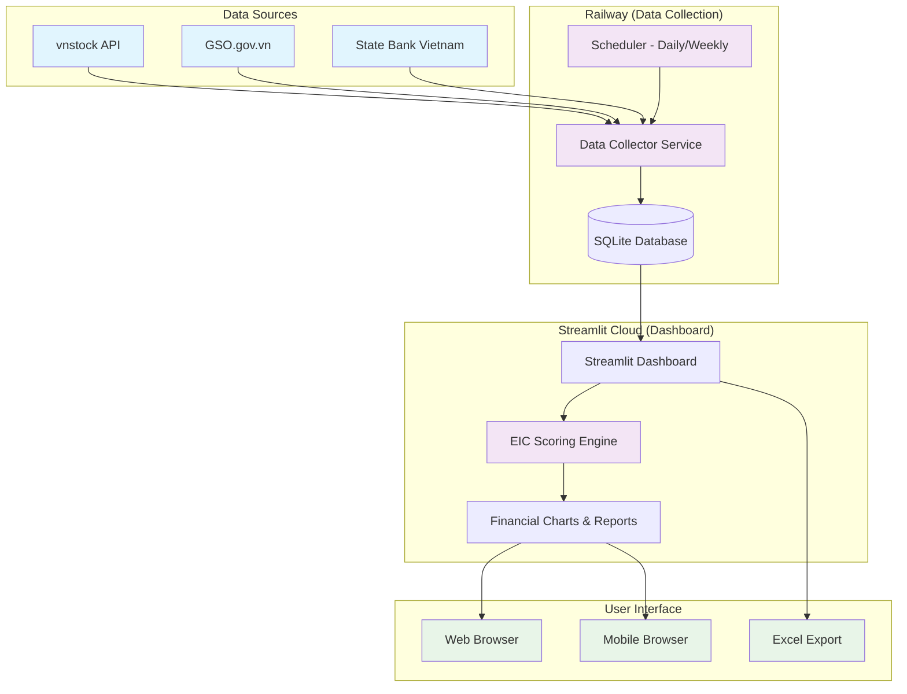
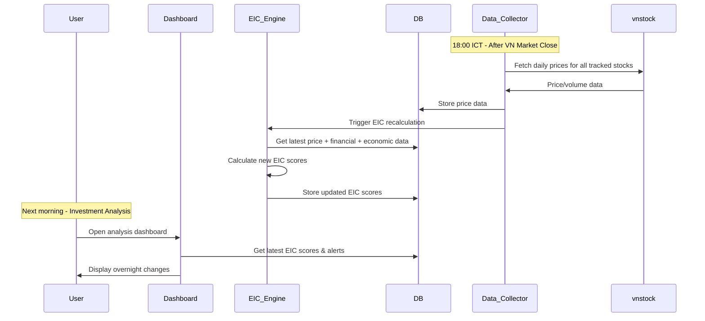
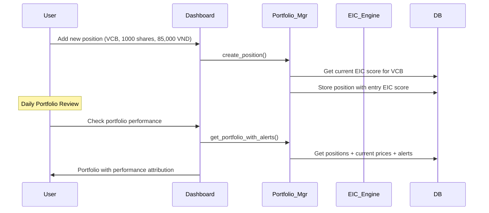
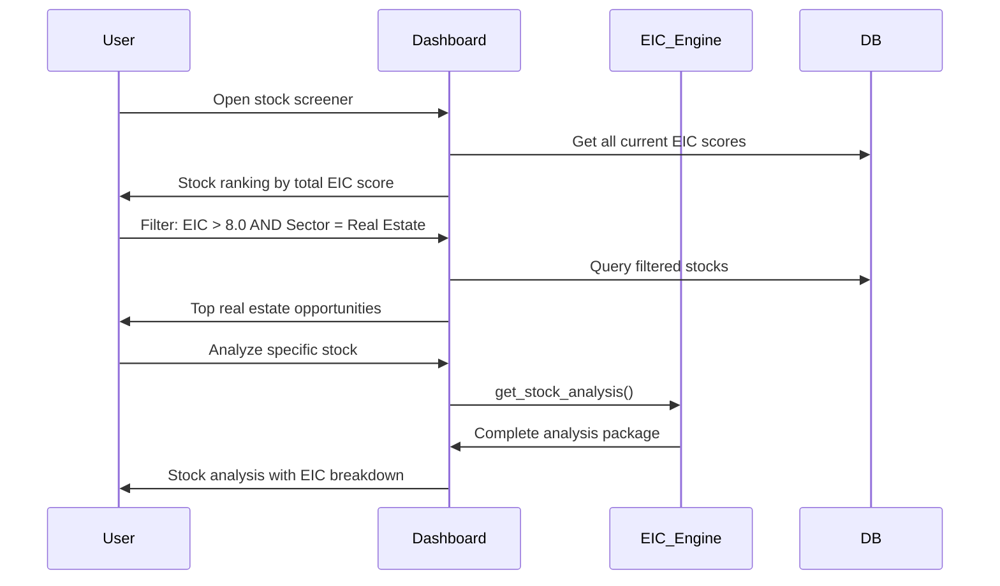

# Vietnam Stock Analysis System Architecture Document

## Introduction

This document outlines the complete fullstack architecture for the Vietnam Stock Analysis System, including backend systems, frontend implementation, and their integration. It serves as the single source of truth for AI-driven development, ensuring consistency across the entire technology stack.

This unified approach combines what would traditionally be separate backend and frontend architecture documents, streamlining the development process for modern fullstack applications where these concerns are increasingly intertwined.

### Starter Template Assessment

**Decision**: Greenfield project with financial data platform optimization

**Reasoning**: The system has unique requirements including real-time financial data processing (vnstock integration), economic indicator data collection (GSO.gov.vn), complex scoring algorithms (EIC framework), and sector-specific analysis for Vietnamese markets. While generic fintech starters exist, the domain-specific requirements justify a purpose-built architecture.

### Change Log

| Date | Version | Description | Author |
|------|---------|-------------|---------|
| 2025-09-17 | 1.0 | Initial architecture document | Winston (Architect) |

## High Level Architecture

### Technical Summary

The Vietnam Stock Analysis System employs a **Finance-First Data Pipeline Architecture** using Python and Streamlit for rapid development and deployment. The system follows an **automated data collection → processing → visualization** pattern optimized for individual investment decision-making. **Streamlit serves as both frontend framework and deployment platform**, eliminating the need for separate frontend/backend concerns while providing professional financial dashboards. **SQLite provides local data persistence** with easy backup and Excel integration capabilities. **Railway hosts the Python data collection services** while Streamlit Cloud handles the dashboard deployment, creating a **cost-effective, maintenance-light solution** that delivers comprehensive EIC scoring and sector analysis for Vietnamese markets.

### Platform and Infrastructure Choice

**Platform:** Streamlit Cloud + Railway
**Key Services:** Streamlit (dashboard), Railway (data collection), SQLite (storage), GitHub (deployment)
**Deployment Host and Regions:** US/Singapore regions for optimal Vietnamese market data access

### Repository Structure

**Structure:** Monorepo with Clear Separation
**Monorepo Tool:** Simple folder structure (no complex tooling needed)
**Package Organization:** Feature-based modules with shared utilities

```
vietnam-stock-analysis/
├── data_collection/          # Railway-deployed data jobs
├── dashboard/               # Streamlit application
├── shared/                  # Common utilities and models
└── docs/                   # Documentation and analysis
```

### High Level Architecture Diagram



### Architectural Patterns

- **ETL Pipeline Pattern:** Daily data extraction, transformation, and loading from Vietnamese sources - _Rationale:_ Financial data requires consistent, scheduled updates with data quality validation
- **Dashboard-as-a-Service:** Streamlit provides immediate visualization without frontend development - _Rationale:_ Rapid iteration on financial metrics and KPIs without technical overhead
- **Configuration-Driven Scoring:** EIC parameters stored in config files for easy modification - _Rationale:_ Finance expert can adjust scoring weights without code changes
- **Event-Driven Updates:** Market close triggers, earnings announcements, economic releases - _Rationale:_ Investment decisions depend on timely data processing and alerts
- **Modular Sector Analysis:** Separate processing modules for Securities, Banking, Real Estate, Steel - _Rationale:_ Each sector has unique metrics and data sources requiring specialized handling

## Tech Stack

### Technology Stack Table

| Category | Technology | Version | Purpose | Rationale |
|----------|------------|---------|---------|-----------|
| **Frontend Language** | Python | 3.11+ | Dashboard development | Streamlit is Python-native, aligns with vnstock and data science ecosystem |
| **Frontend Framework** | Streamlit | 1.28+ | Interactive dashboards | Finance-friendly with built-in charts, no HTML/CSS required |
| **UI Component Library** | Streamlit Components | Built-in | Charts and widgets | Plotly integration for financial charts, AgGrid for data tables |
| **State Management** | Streamlit Session State | Built-in | User preferences and filters | Simple state management without Redux complexity |
| **Backend Language** | Python | 3.11+ | Data processing and APIs | Consistent with frontend, vnstock compatibility |
| **Backend Framework** | FastAPI | 0.104+ | Optional API layer | If API needed later, Python-native, auto-documentation |
| **API Style** | Direct DB Access | N/A | Streamlit → SQLite | Streamlit can directly query database, no API needed initially |
| **Database** | SQLite | 3.42+ | Local data storage | File-based, easy backup, Excel export, perfect for single-user |
| **Cache** | Streamlit Cache | Built-in | Data and computation caching | @st.cache_data for expensive EIC calculations |
| **File Storage** | Local Filesystem | N/A | Reports and exports | Simple file storage, easy Excel/CSV export |
| **Authentication** | Streamlit Cloud Auth | Built-in | Basic access control | GitHub-based auth for deployment |
| **Frontend Testing** | Pytest + Streamlit | 7.4+ | Component testing | Python-native testing framework |
| **Backend Testing** | Pytest | 7.4+ | Data processing tests | Standard Python testing |
| **E2E Testing** | Manual Testing | N/A | User workflow validation | Given Streamlit's simplicity, manual testing sufficient |
| **Build Tool** | Python pip | 23+ | Dependency management | Standard Python package management |
| **Bundler** | Streamlit | Built-in | App bundling | Streamlit handles bundling automatically |
| **IaC Tool** | Railway Config | YAML | Infrastructure as code | Simple YAML config for Railway deployment |
| **CI/CD** | GitHub Actions | N/A | Automated deployment | Free tier sufficient for our needs |
| **Monitoring** | Streamlit Metrics | Built-in | Basic app monitoring | Built-in metrics, Railway monitoring for jobs |
| **Logging** | Python logging | Built-in | Error tracking | Standard Python logging to files |
| **CSS Framework** | Streamlit Theming | Built-in | Styling and responsive design | Built-in themes with custom CSS injection if needed |

### Additional Finance-Specific Tools

| Category | Technology | Version | Purpose | Rationale |
|----------|------------|---------|---------|-----------|
| **Vietnamese Data** | vnstock | 1.0+ | Stock market data | Primary data source for Vietnamese stocks |
| **Economic Data** | requests + BeautifulSoup | 2.31+ / 4.12+ | GSO.gov.vn scraping | Web scraping for economic indicators |
| **Financial Charts** | Plotly | 5.17+ | Candlestick and technical charts | Superior financial visualization |
| **Data Analysis** | pandas | 2.1+ | Data manipulation | Essential for financial data processing |
| **Numerical Computing** | numpy | 1.25+ | EIC calculations | Fast numerical operations |
| **Scheduling** | APScheduler | 3.10+ | Automated data collection | Railway cron jobs for daily data updates |
| **Excel Integration** | openpyxl | 3.1+ | Report generation | Export to Excel for further analysis |

## Data Models

### Stock

**Purpose:** Represents individual Vietnamese stocks across your 4 target sectors (Securities, Banking, Real Estate, Steel)

**Key Attributes:**
- symbol: string - Stock ticker (e.g., "VCB", "SSI", "VHM", "HPG")
- name: string - Company full name in Vietnamese and English
- sector: string - One of: "securities", "banking", "real_estate", "steel"
- exchange: string - "HOSE", "HNX", or "UPCOM"
- market_cap: float - Current market capitalization in VND
- industry_group: string - Detailed industry classification
- listing_date: date - IPO/listing date for historical context

#### TypeScript Interface
```typescript
interface Stock {
  symbol: string;
  name: string;
  name_en: string;
  sector: 'securities' | 'banking' | 'real_estate' | 'steel';
  exchange: 'HOSE' | 'HNX' | 'UPCOM';
  market_cap: number;
  industry_group: string;
  listing_date: string; // ISO date
  is_active: boolean;
  created_at: string;
  updated_at: string;
}
```

#### Relationships
- Has many PriceData (daily price history)
- Has many FinancialData (quarterly/annual reports)
- Has many EICScores (calculated scores over time)

### PriceData

**Purpose:** Daily stock price and volume data from vnstock, essential for technical analysis and momentum scoring

**Key Attributes:**
- stock_symbol: string - Foreign key to Stock
- date: date - Trading date
- open: float - Opening price in VND
- high: float - Highest price in VND
- low: float - Lowest price in VND
- close: float - Closing price in VND
- volume: integer - Number of shares traded
- value: float - Total trading value in VND
- foreign_buy: float - Foreign investor purchases
- foreign_sell: float - Foreign investor sales

#### TypeScript Interface
```typescript
interface PriceData {
  stock_symbol: string;
  date: string; // ISO date
  open: number;
  high: number;
  low: number;
  close: number;
  volume: number;
  value: number;
  foreign_buy: number;
  foreign_sell: number;
  foreign_net: number; // calculated field
  price_change: number; // calculated field
  price_change_percent: number; // calculated field
}
```

#### Relationships
- Belongs to Stock
- Used by EICScore calculations

### FinancialData

**Purpose:** Quarterly and annual financial statements for fundamental analysis, supporting company-level EIC scoring

**Key Attributes:**
- stock_symbol: string - Foreign key to Stock
- period: string - "Q1-2024", "Q2-2024", "2023" format
- period_type: string - "quarterly" or "annual"
- revenue: float - Net revenue in billion VND
- profit: float - Net profit in billion VND
- total_assets: float - Total assets in billion VND
- equity: float - Total equity in billion VND
- debt: float - Total debt in billion VND
- roe: float - Return on Equity percentage
- roa: float - Return on Assets percentage
- pe_ratio: float - Price-to-Earnings ratio
- pb_ratio: float - Price-to-Book ratio
- debt_equity: float - Debt-to-Equity ratio

#### TypeScript Interface
```typescript
interface FinancialData {
  stock_symbol: string;
  period: string;
  period_type: 'quarterly' | 'annual';
  revenue: number;
  profit: number;
  total_assets: number;
  equity: number;
  debt: number;
  roe: number;
  roa: number;
  pe_ratio: number;
  pb_ratio: number;
  debt_equity: number;
  profit_margin: number; // calculated
  asset_turnover: number; // calculated
  report_date: string;
}
```

#### Relationships
- Belongs to Stock
- Used by EICScore calculations

### EconomicIndicator

**Purpose:** Vietnamese macroeconomic data from GSO.gov.vn and State Bank, supporting economy-level EIC scoring

**Key Attributes:**
- indicator_code: string - "GDP_GROWTH", "CPI_INFLATION", "INTEREST_RATE"
- indicator_name: string - Human-readable name
- period: string - "2024-Q1", "2024-03" format
- value: float - Indicator value (percentage, absolute, or index)
- unit: string - "percent", "billion_vnd", "index"
- source: string - "GSO", "SBV", "MINISTRY_OF_FINANCE"
- category: string - "growth", "inflation", "monetary", "fiscal"

#### TypeScript Interface
```typescript
interface EconomicIndicator {
  indicator_code: string;
  indicator_name: string;
  period: string;
  value: number;
  unit: string;
  source: 'GSO' | 'SBV' | 'MINISTRY_OF_FINANCE';
  category: 'growth' | 'inflation' | 'monetary' | 'fiscal';
  release_date: string;
  created_at: string;
}
```

#### Relationships
- Used by EICScore calculations
- Independent of individual stocks

### EICScore

**Purpose:** Your calculated EIC (Economy-Industry-Company) scores over time, the core output of your analysis system

**Key Attributes:**
- stock_symbol: string - Foreign key to Stock
- date: date - Calculation date
- economy_score: float - Economy level score (0-10)
- industry_score: float - Industry/sector level score (0-10)
- company_score: float - Company fundamentals score (0-10)
- total_score: float - Weighted total score (0-10)
- economy_weight: float - Weight applied to economy score (default 0.30)
- industry_weight: float - Weight applied to industry score (default 0.35)
- company_weight: float - Weight applied to company score (default 0.35)
- recommendation: string - "STRONG_BUY", "BUY", "HOLD", "SELL", "STRONG_SELL"

#### TypeScript Interface
```typescript
interface EICScore {
  stock_symbol: string;
  date: string; // ISO date
  economy_score: number;
  industry_score: number;
  company_score: number;
  total_score: number;
  economy_weight: number;
  industry_weight: number;
  company_weight: number;
  recommendation: 'STRONG_BUY' | 'BUY' | 'HOLD' | 'SELL' | 'STRONG_SELL';
  confidence_level: number; // 0-1 scale
  calculation_version: string; // track algorithm changes
  sector_rank: number; // Rank within sector (1 = best)
  market_percentile: number; // Percentile across all stocks
  score_change_7d: number; // Score change over 7 days
  created_at: string;
}
```

#### Relationships
- Belongs to Stock
- References PriceData and FinancialData
- References EconomicIndicator data

### Portfolio

**Purpose:** Track actual investment positions and correlate performance with EIC predictions for system validation

#### TypeScript Interface
```typescript
interface Portfolio {
  user_id: string;
  stock_symbol: string;
  position_size: number;      // Number of shares
  entry_price: number;        // Average entry price
  entry_date: string;
  current_value: number;      // Calculated field
  unrealized_pnl: number;     // Calculated field
  eic_score_at_entry: number; // EIC score when position opened
}
```

### Alert

**Purpose:** Monitor EIC score changes and market events to notify of investment opportunities or risks

#### TypeScript Interface
```typescript
interface Alert {
  stock_symbol: string;
  alert_type: 'SCORE_CHANGE' | 'PRICE_THRESHOLD' | 'VOLUME_SPIKE';
  trigger_value: number;
  current_value: number;
  created_at: string;
  is_read: boolean;
}
```

## API Specification

### Internal Data Access (Streamlit ↔ SQLite)

Since we're using Streamlit with direct SQLite access, we define clear **data access functions** that act as our internal API:

#### Data Access Layer Functions

```python
# Stock Data Access
def get_stocks_by_sector(sector: str) -> List[Stock]:
    """Get all stocks in a specific sector"""

def get_stock_by_symbol(symbol: str) -> Optional[Stock]:
    """Get single stock by symbol"""

# Price Data Access
def get_latest_prices(symbols: List[str]) -> List[PriceData]:
    """Get most recent price data for multiple stocks"""

def get_price_history(symbol: str, start_date: date, end_date: date) -> List[PriceData]:
    """Get historical price data for charting"""

# EIC Score Access
def get_current_eic_scores(sector: Optional[str] = None) -> List[EICScore]:
    """Get latest EIC scores, optionally filtered by sector"""

def calculate_eic_score(symbol: str, date: date) -> EICScore:
    """Calculate new EIC score for given stock and date"""

# Portfolio Management
def get_portfolio_positions() -> List[Portfolio]:
    """Get all current portfolio positions"""

def add_position(symbol: str, shares: int, price: float) -> Portfolio:
    """Add new position to portfolio"""
```

### External API Integrations

#### vnstock API Integration

```python
import vnstock as vn

def fetch_stock_prices(symbol: str, start_date: str, end_date: str) -> pd.DataFrame:
    """Fetch price data from vnstock"""

def fetch_financial_data(symbol: str) -> dict:
    """Fetch company financials from vnstock"""
```

**vnstock API Endpoints Used:**
- `stock_historical_data(symbol, start, end)` - Daily price/volume data
- `company_profile(symbol)` - Company basic information
- `financial_ratio(symbol)` - Financial ratios and metrics
- `foreign_investor_flows(symbol)` - Foreign investment data

#### GSO.gov.vn Economic Data Integration

```python
import requests
from bs4 import BeautifulSoup

def fetch_gdp_data() -> dict:
    """Scrape GDP growth data from GSO"""

def fetch_inflation_data() -> dict:
    """Scrape CPI inflation data from GSO"""
```

**GSO.gov.vn Endpoints:**
- `https://gso.gov.vn/px-web-2/?theme=1` - GDP and economic growth
- `https://gso.gov.vn/px-web-2/?theme=3` - Price indices and inflation

#### Data Collection Workflow

```python
@scheduler.scheduled_job('cron', hour=18, minute=0, timezone='Asia/Ho_Chi_Minh')
def daily_data_collection():
    """Runs after Vietnam market close (15:00 + buffer)"""

@scheduler.scheduled_job('cron', day_of_week='mon', hour=9, minute=0)
def weekly_economic_update():
    """Runs Monday mornings"""
```

## Components

### Data Collection Service

**Responsibility:** Automated collection and processing of Vietnamese market data from multiple sources (vnstock, GSO.gov.vn, State Bank Vietnam)

**Key Interfaces:**
- `collect_daily_stock_data()` - Fetch price/volume data after market close
- `collect_economic_indicators()` - Scrape GSO economic data weekly
- `validate_data_quality()` - Ensure data integrity before storage

**Dependencies:** vnstock library, requests/BeautifulSoup for scraping, SQLite database, APScheduler

**Technology Stack:** Python 3.11, deployed on Railway with scheduled cron jobs

### EIC Scoring Engine

**Responsibility:** Calculate Economy-Industry-Company scores using your proprietary weighting system and Vietnamese market-specific factors

**Key Interfaces:**
- `calculate_economy_score(date)` - Process macro indicators into 0-10 score
- `calculate_industry_score(sector, date)` - Sector-level analysis and scoring
- `calculate_company_score(symbol, date)` - Individual stock fundamental analysis
- `calculate_composite_eic(symbol, date)` - Weighted final score with recommendation

**Dependencies:** Data Collection Service output, FinancialData models, EconomicIndicator models

**Technology Stack:** Pure Python with pandas/numpy for calculations, configurable weights stored in YAML files

### Dashboard Application

**Responsibility:** Interactive Streamlit web interface for EIC analysis, portfolio management, and investment decision support

**Key Interfaces:**
- `render_market_overview()` - Sector performance and top EIC scores
- `render_stock_analysis()` - Deep dive into individual stock EIC breakdown
- `render_portfolio_dashboard()` - Current positions and performance tracking
- `render_alert_center()` - EIC score changes and threshold alerts

**Dependencies:** EIC Scoring Engine results, Portfolio models, SQLite database

**Technology Stack:** Streamlit 1.28+, Plotly for financial charts, deployed on Streamlit Cloud

### Portfolio Manager

**Responsibility:** Track actual investment positions and correlate performance with EIC predictions for system validation

**Key Interfaces:**
- `add_position(symbol, shares, price)` - Record new stock purchases
- `calculate_portfolio_performance()` - Returns vs EIC predictions
- `generate_attribution_report()` - Which EIC factors drove returns

**Dependencies:** Portfolio and Position models, current price data, EIC score history

**Technology Stack:** Python with pandas for calculations, integrated into Streamlit dashboard

### Alert System

**Responsibility:** Monitor EIC score changes and market events to notify of investment opportunities or risks

**Key Interfaces:**
- `monitor_eic_changes()` - Detect significant score movements
- `check_price_thresholds()` - Price-based alerts for positions
- `generate_daily_summary()` - Morning briefing of overnight changes

**Dependencies:** EIC Scoring Engine, Price data, Alert configuration models

**Technology Stack:** Background Python processes, configurable thresholds

## Core Workflows

### Daily Market Analysis Workflow



### Portfolio Position Management Workflow



### New Stock Discovery Workflow



---

*This architecture document provides the foundation for developing a comprehensive Vietnamese stock analysis system optimized for individual investment decision-making using the EIC framework.*